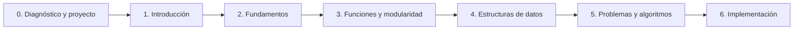

# Guía docente: Programación Creativa

## 1. Propósito de la guía

Esta guía convierte el programa de la asignatura en una ruta de trabajo para el docente. La materia se desarrolla en 12 clases de 2 horas, distribuidas aproximadamente en cuatro semanas de tres clases. El curso contempla 24 horas presenciales y 120 horas de trabajo no presencial, para un total de 144 horas. TypeScript y React funcionan como herramientas principales, mientras que el portafolio y el vibecoding acompañan todo el proceso.

La programación se presenta como una herramienta para analizar problemas, construir soluciones y expresar ideas mediante interfaces y aplicaciones web. Cada estudiante construye un portafolio con pequeños proyectos de aprendizaje y un proyecto integrador final.

## 2. Alineación general

### Objetivo general

Diseñar, implementar y probar interfaces web interactivas con TypeScript y React, aplicando fundamentos de programación, pensamiento algorítmico, buenas prácticas de desarrollo y uso crítico de herramientas de inteligencia artificial.

### Resultados de aprendizaje

Al finalizar la asignatura, el estudiante podrá:

1. Analizar un problema y representarlo mediante pasos, pseudocódigo o diagramas de flujo.
2. Implementar programas básicos usando variables, tipos de datos, operadores, entradas, salidas, condicionales y ciclos.
3. Diseñar funciones y módulos para organizar, reutilizar y mantener el código.
4. Organizar y manipular información mediante estructuras de datos simples.
5. Probar, depurar y mejorar soluciones considerando claridad, funcionamiento y eficiencia.
6. Desarrollar y presentar un portafolio con proyectos pequeños y un proyecto integrador que evidencien el proceso de aprendizaje.

### Competencias

- pensamiento computacional y lógico;
- resolución estructurada de problemas;
- creatividad aplicada a la tecnología;
- comunicación de procesos y decisiones técnicas;
- trabajo autónomo y colaborativo;
- uso responsable de herramientas digitales.
- uso crítico, transparente y verificable de herramientas de inteligencia artificial.

## 3. Principios para impartir la materia

- Explicar poco y hacer mucho: cada concepto debe acompañarse de una demostración y una práctica.
- Comenzar con problemas pequeños antes de introducir proyectos complejos.
- Pedir que el estudiante explique su solución, no solo que entregue código.
- Tratar los errores como parte normal del proceso de prueba y depuración.
- Relacionar cada tema con el proyecto final desde el inicio.
- Evaluar tanto el proceso como el producto.
- Usar la inteligencia artificial como asistente para explorar y prototipar, no como sustituto de la comprensión.

## 4. Distribución de la dedicación

| Modalidad | Horas | Trabajo principal |
|---|---:|---|
| Presencial | 24 | Explicación, ejercicios, resolución de dudas, laboratorio y revisiones |
| No presencial | 120 | Lecturas, prácticas, mini proyectos, portafolio, proyecto final y estudio para el examen |
| **Total** | **144** | **Dedicación total de la asignatura** |

Las 120 horas no presenciales equivalen aproximadamente a 10 horas por cada clase. Para que sean realistas, deben organizarse mediante entregables y no presentarse como una cantidad indefinida de trabajo autónomo.

### Distribución sugerida del trabajo no presencial

| Actividad | Horas aproximadas |
|---|---:|
| Práctica técnica de TypeScript y React | 36 |
| Mini proyectos y construcción del portafolio | 24 |
| Desarrollo del proyecto integrador | 40 |
| Estudio y preparación del examen | 12 |
| Documentación, reflexión y revisión entre pares | 8 |
| **Total** | **120** |

### Distribución semanal

| Semana | Horas no presenciales | Trabajo esperado |
|---:|---:|---|
| 1 | 30 h | Práctica de TypeScript y React, configuración, primer componente y calculadora |
| 2 | 30 h | Componentes, funciones, props, catálogo y documentación del portafolio |
| 3 | 30 h | Arreglos, objetos, tiendita, algoritmos y preparación del examen |
| 4 | 30 h | Proyecto integrador, pruebas, publicación, presentación y reflexión |

Estas horas incluyen estudio, lectura de documentación, práctica deliberada, resolución de errores, construcción de proyectos, documentación y preparación del examen. No deben entenderse como cuatro semanas de trabajo exclusivamente frente al computador: también incluyen planificación y reflexión.

## 5. Estructura recomendada de una sesión

1. **Explicación - 30 minutos:** concepto, demostración y conexión con el proyecto.
2. **Ejercicio - 30 minutos:** práctica guiada o reto corto para comprobar el concepto.
3. **Laboratorio - 60 minutos:** resolución de dudas, trabajo en proyectos, revisión de código y checkpoint de avance.

La última hora no debe ser únicamente tiempo libre. Cada clase debe cerrar con un producto observable: un commit, una función, una pantalla, una prueba, una decisión documentada o una entrega parcial. El docente puede reservar los últimos 5 minutos de esa hora para registrar avances y bloqueos.

## 6. Stack técnico y publicación

### Stack base

El curso utilizará un stack deliberadamente pequeño:

- **TypeScript:** lenguaje principal para aprender variables, tipos, funciones, objetos y estructuras de datos.
- **React:** biblioteca para construir interfaces a partir de componentes, eventos, estado y propiedades.
- **Vite:** herramienta de desarrollo y construcción del proyecto. Se usará la plantilla oficial `react-ts`, con servidor local y recarga rápida.
- **CSS nativo:** estilos básicos sin añadir todavía un framework visual.
- **Git y GitHub:** historial del código y repositorio del estudiante.
- **Vercel:** publicación de la aplicación y generación de una URL pública.

Vite ofrece una plantilla `react-ts` y una experiencia de desarrollo ligera; su [documentación oficial](https://vite.dev/guide/) indica que el proyecto se inicia con `npm create vite@latest`. React se trabajará mediante componentes, listas, eventos y actualización de la interfaz, siguiendo su [guía de inicio](https://react.dev/learn). Vercel puede importar un repositorio Git y generar despliegues automáticos para cada cambio, como explica su [guía para proyectos Vite](https://vercel.com/docs/frameworks/frontend/vite).

### Decisiones para mantener el curso ligero

Durante las primeras 12 clases no se incorporarán Redux, bases de datos, autenticación, Tailwind, un sistema de diseño ni múltiples librerías de componentes. Se trabajará con React, TypeScript, CSS nativo y las APIs del navegador. Estas herramientas podrán aparecer como extensiones opcionales en el proyecto final, nunca como requisito para aprobar.

### Proyecto base del curso

Cada estudiante tendrá un único repositorio llamado, por ejemplo, `portafolio-programacion`. Dentro de la misma aplicación habrá:

- una página de inicio;
- una sección para cada mini proyecto;
- una sección para el proyecto integrador;
- una ficha breve de aprendizaje y tecnologías utilizadas.

Así, cada clase deja algo publicable y el estudiante termina con una URL que puede mostrar en su portafolio.

### Configuración inicial

```bash
npm create vite@latest portafolio-programacion -- --template react-ts
cd portafolio-programacion
npm install
npm run dev
```

Antes de la primera clase se debe comprobar que Node.js, npm, Git, un editor de código y una cuenta de GitHub funcionen en los equipos. La versión de Node.js debe cumplir el requisito indicado por la documentación vigente de Vite.

### Publicación en Vercel

1. Crear el repositorio en GitHub y subir el proyecto.
2. Importar el repositorio desde Vercel.
3. Confirmar el framework Vite y el comando de construcción `npm run build`.
4. Confirmar la carpeta de salida `dist` si Vercel no la detecta automáticamente.
5. Compartir la URL pública y actualizarla cada vez que se publique un cambio.

La primera publicación debe hacerse con una aplicación mínima. Después se publicarán la calculadora, la tiendita y el proyecto final dentro del mismo portafolio.

## 7. Unidades del curso

### Unidad 0. Diagnóstico y planteamiento del proyecto

**Propósito:** conocer el punto de partida del grupo y transformar una idea creativa en un proyecto viable.

**Resultado de aprendizaje:** el estudiante describe una necesidad o idea, formula un objetivo, configura su entorno y propone una primera solución programable para su portafolio o proyecto final.

**Contenidos:** programación creativa; diagnóstico; TypeScript, React y entorno de trabajo; portafolio; problemas, usuarios y necesidades; objetivo, alcance y restricciones; criterios de éxito.

**Actividades:** aplicar un diagnóstico breve; revisar ejemplos de portafolios; configurar el proyecto base; generar y seleccionar ideas; elaborar una ficha con problema, usuario, objetivo, entradas, salidas y alcance.

**Evidencia:** diagnóstico, repositorio o carpeta de trabajo, estructura inicial del portafolio y ficha del proyecto final.

**Criterios:** el problema está delimitado, el objetivo es comprensible y la propuesta puede abordarse con los contenidos del curso.

### Unidad 1. Introducción a la programación

**Propósito:** comprender cómo una idea se convierte en instrucciones que el computador puede ejecutar.

**Resultado de aprendizaje:** el estudiante explica la relación entre problema, algoritmo, programa y lenguaje, y construye una interfaz React sencilla con TypeScript.

**Contenidos:** algoritmo, programa y lenguaje; componentes; JSX; tipado básico; props; entorno de trabajo; flujo de ejecución; errores; entrada, procesamiento y salida.

**Actividades:** describir una tarea como instrucciones; leer y modificar un componente; crear una tarjeta o página de bienvenida; pedir a una herramienta de IA una explicación o alternativa; revisar, ejecutar y corregir el resultado.

**Evidencia:** primer componente React ejecutable, con tipos básicos y explicación de cualquier asistencia de IA utilizada.

**Criterios:** el programa se ejecuta, las instrucciones están ordenadas y el estudiante explica cada paso.

### Unidad 2. Fundamentos de programación

**Propósito:** construir programas que reciban datos, tomen decisiones y repitan acciones.

**Resultado de aprendizaje:** el estudiante implementa interacciones usando variables, tipos, operadores, condicionales, ciclos y estado de React.

**Contenidos:** variables y constantes en TypeScript; tipos; operadores; condicionales; ciclos; funciones de transformación; eventos; estado y formularios en React.

**Actividades:** ejercicios de cálculo y conversión; contador; formulario con validación; lista renderizada; reto interactivo con eventos y estado.

**Evidencia:** mini proyecto de aprendizaje: calculadora tipada o conversor interactivo, publicado en el portafolio con datos de prueba.

**Criterios:** selecciona estructuras adecuadas, usa nombres comprensibles, prueba casos normales y límite, y obtiene resultados correctos.

### Unidad 3. Funciones y modularidad

**Propósito:** organizar el código para que sea legible, reutilizable y fácil de modificar.

**Resultado de aprendizaje:** el estudiante divide una interfaz en componentes y funciones con responsabilidades claras, utilizando props, parámetros y valores de retorno.

**Contenidos:** funciones; parámetros y retorno; interfaces y tipos; componentes; props; estado local; reutilización; descomposición; módulos y buenas prácticas.

**Actividades:** convertir repeticiones en funciones; separar una interfaz en componentes; refactorizar código generado o sugerido por IA; revisión entre pares; documentar decisiones.

**Evidencia:** mini proyecto modular, como una tarjeta de productos o perfil, con componentes reutilizables y explicación de su estructura.

**Criterios:** cada función tiene una responsabilidad, recibe y devuelve datos coherentes, evita repeticiones y mantiene una estructura legible.

### Unidad 4. Estructuras de datos simples

**Propósito:** almacenar y manipular conjuntos de información dentro de un programa.

**Resultado de aprendizaje:** el estudiante selecciona y utiliza arreglos y objetos tipados para almacenar, recorrer, consultar y modificar información en una interfaz.

**Contenidos:** arreglos y objetos en TypeScript; interfaces; índices; map, filter y find; búsqueda y actualización; datos relacionados; estado de colecciones.

**Actividades:** crear una colección de productos; mostrar tarjetas; filtrar y buscar; modificar cantidades; construir una primera versión de la tiendita.

**Evidencia:** mini proyecto de aprendizaje: tiendita o catálogo interactivo, con datos tipados, búsqueda o filtro y sección publicada en el portafolio.

**Criterios:** los datos están organizados, el acceso es correcto y las operaciones principales están separadas en funciones cuando corresponda.

### Unidad 5. Resolución de problemas y algoritmos

**Propósito:** integrar los contenidos anteriores para diseñar soluciones claras antes de programarlas.

**Resultado de aprendizaje:** el estudiante descompone un problema, propone un algoritmo, diseña casos de prueba y utiliza vibecoding de forma crítica y verificable.

**Contenidos:** comprensión y delimitación; descomposición; pseudocódigo y diagramas; secuencia, decisión y repetición; casos de prueba; depuración; prompts; revisión de código; documentación de asistencia de IA.

**Actividades:** resolver un problema sin computador; convertirlo en pseudocódigo o diagrama; escribir un prompt con contexto y restricciones; comparar la sugerencia de IA con una solución propia; preparar el algoritmo definitivo del proyecto.

**Evidencia:** documento de diseño con problema, algoritmo, datos, funciones, casos de prueba, plan de implementación y bitácora de prompts, cambios y verificaciones.

**Criterios:** la solución es comprensible, está dividida en pasos, contempla casos relevantes y se relaciona con el código que se implementará.

### Unidad 6. Implementación del proyecto

**Propósito:** integrar los aprendizajes en un producto creativo funcional y comunicar el proceso.

**Resultado de aprendizaje:** el estudiante implementa, prueba, mejora y presenta un proyecto que responde al objetivo planteado, integrándolo en su portafolio.

**Fases:** prototipo mínimo; implementación; pruebas; depuración; mejora; presentación.

**Evidencias:** prototipo; versión final; código organizado; documentación; demostración; reflexión individual; página de proyecto en el portafolio.

**Criterios:** cumplimiento del objetivo, funcionamiento, integración de contenidos, creatividad, calidad del proceso, documentación y capacidad de explicar decisiones.

## 8. Portafolio y proyectos de aprendizaje

El portafolio se construye desde la primera clase y reúne evidencias del proceso. No debe ser únicamente una galería: cada proyecto debe explicar qué problema resuelve, qué se aprendió y qué se mejoró.

### Proyectos pequeños sugeridos

1. **Calculadora o conversor:** variables, funciones, eventos, estado y validación.
2. **Tarjeta o catálogo de productos:** componentes, props, tipos y renderizado.
3. **Tiendita:** arreglos, objetos, filtros, cantidades y estado de colecciones.
4. **Proyecto integrador:** aplicación elegida por el estudiante, con alcance acotado.

Cada proyecto debe incluir una demostración, código, breve explicación, aprendizajes, errores corregidos y asistencia de IA utilizada, si la hubo.

## 9. Proyecto final

Puede ser un generador visual, juego pequeño, simulación, visualización de datos, experiencia audiovisual o herramienta interactiva.

Debe incluir:

- problema, pregunta o intención creativa;
- entradas y salidas identificables;
- variables y estructuras de control;
- al menos dos funciones propias;
- una estructura de datos simple cuando sea pertinente;
- pruebas y correcciones documentadas;
- presentación del resultado;
- una sección propia dentro del portafolio.

El lenguaje y el entorno base serán TypeScript y React. La guía mantiene los conceptos de programación claramente separados de la sintaxis para que el estudiante entienda qué problema está resolviendo y no solo qué código debe copiar.

### Protocolo de vibecoding

En cada actividad asistida por IA, el estudiante debe:

1. describir el problema y las restricciones antes de pedir código;
2. revisar la propuesta y señalar qué partes entiende y cuáles debe investigar;
3. ejecutar y probar el resultado con casos propios;
4. corregir o adaptar el código;
5. registrar el prompt relevante, los cambios realizados y lo aprendido.

## 10. Evaluación


| Componente | Porcentaje | Evidencias principales |
|---|---:|---|
| Proyectos pequeños y ejercicios | 25 % | Calculadora, catálogo, tiendita y prácticas de fundamentos |
| Portafolio y documentación | 15 % | Organización, explicaciones, bitácora, pruebas y mejoras |
| Proyecto integrador final | 30 % | Producto funcional, código, presentación y sección final del portafolio |
| Examen individual | 20 % | Conceptos, lectura de código, depuración y resolución de problemas |
| Vibecoding responsable | 5 % | Prompts, revisión, verificación, atribución y explicación del código asistido |
| Participación y revisión entre pares | 5 % | Trabajo de aula, retroalimentación y colaboración |

### Examen individual

El examen debe comprobar comprensión individual y no solo memoria de sintaxis. Puede incluir:

- lectura y explicación de un componente React;
- identificación y corrección de errores de TypeScript;
- predicción del resultado de una función o interacción;
- diseño de una solución breve mediante pseudocódigo;
- implementación de una función o componente pequeño.

Se recomienda realizarlo en la clase 9, sin asistencia de IA, durante la última hora de la sesión. La primera hora se mantiene como explicación y ejercicio de algoritmos; el diseño detallado del proyecto integrador se entrega como trabajo no presencial posterior. El examen debe tener una guía de criterios conocida previamente por el grupo.

### Criterios transversales

- corrección y funcionamiento;
- claridad del algoritmo y del código;
- capacidad para explicar la solución;
- uso pertinente de los conceptos;
- prueba, depuración y mejora;
- creatividad y relación con el propósito;
- responsabilidad en las entregas.
- comprensión y verificación del código asistido por IA;
- transparencia sobre el uso de herramientas de IA.

## 11. Instrumentos recomendados

- lista de cotejo para ejercicios;
- rúbrica para el proyecto;
- cuestionarios cortos;
- registro de errores y soluciones;
- autoevaluación y coevaluación;
- bitácora de avance.
- rúbrica de uso responsable de IA.
- examen individual escrito y práctico, realizado sin asistencia de IA.

## 12. Plan de 12 clases

| Clase | Enfoque | Producto de la sesión |
|---:|---|---|
| 1 | Diagnóstico, entorno, repositorio y portafolio | Diagnóstico, repositorio y primera publicación |
| 2 | Introducción a React, JSX y TypeScript | Componente de bienvenida |
| 3 | Variables, tipos, operadores y eventos | Interacción simple |
| 4 | Condicionales, ciclos, estado y formularios | Calculadora publicada |
| 5 | Funciones, props y componentes | Tarjeta o catálogo |
| 6 | Modularidad, refactorización y revisión de IA | Mini proyecto modular |
| 7 | Arreglos, objetos y renderizado de listas | Lista de productos |
| 8 | Búsqueda, filtros y estado de colecciones | Tiendita publicada |
| 9 | Algoritmos, pseudocódigo y casos de prueba | Examen individual y diseño del proyecto final |
| 10 | Vibecoding aplicado y prototipo | Prototipo funcional |
| 11 | Integración, pruebas, depuración y portafolio | Versión candidata a entrega |
| 12 | Publicación final, presentaciones, retroalimentación y reflexión | URL final, proyecto y portafolio |

Cada clase de 2 horas sigue la estructura de 30 minutos de explicación, 30 minutos de ejercicio y 60 minutos de laboratorio. El cierre se integra en los últimos minutos del laboratorio mediante el checkpoint de avance.

## 13. Pendientes antes de impartir el curso

1. Definir la plantilla inicial de React y el flujo de publicación.
2. Preparar una política breve de uso de IA y protección de datos.
3. Preparar requisitos técnicos y alternativas sin computador.
4. Crear la rúbrica del portafolio y del proyecto final.
5. Seleccionar ejemplos y repositorios base adecuados al grupo.

## 14. Secuencia del curso


