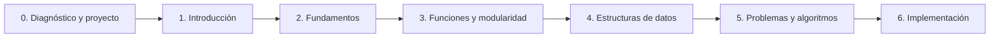

# Guía docente: Programación Creativa

## 1. Propósito de la guía

Esta guía convierte el programa de la asignatura en una ruta de trabajo para el docente. La materia se desarrolla durante 21 semanas y contempla 36 horas presenciales —16 teóricas y 20 prácticas—, 108 horas de trabajo no presencial y 144 horas en total. Para organizar las 36 horas, esta guía propone 12 encuentros de 3 horas. TypeScript y React funcionan como herramientas principales, mientras que el portafolio y el vibecoding acompañan todo el proceso.

La programación se presenta como una herramienta para analizar problemas, construir soluciones y expresar ideas mediante interfaces y aplicaciones web. Cada estudiante construye un portafolio con pequeños proyectos de aprendizaje y un proyecto integrador final.

## 2. Alineación general

### Objetivo general

Desarrollar habilidades de programación y pensamiento computacional para resolver problemas algorítmicos básicos de manera estructurada, lógica y creativa, utilizando lenguajes y herramientas de programación apropiados.

### Resultados de aprendizaje

Al finalizar la asignatura, el estudiante podrá:

1. Comprender y aplicar variables, operadores, estructuras de control y funciones para resolver problemas de programación sencillos.
2. Diseñar e implementar programas mediante técnicas de resolución de problemas, verificando la corrección y eficiencia básica de sus soluciones.
3. Desarrollar pensamiento lógico y computacional para descomponer problemas en tareas más pequeñas y aplicar algoritmos que conduzcan a soluciones efectivas.

### Competencias

- pensamiento computacional y lógico;
- resolución estructurada de problemas;
- creatividad aplicada a la tecnología;
- comunicación de procesos y decisiones técnicas;
- trabajo autónomo y colaborativo;
- uso responsable de herramientas digitales.
- uso crítico, transparente y verificable de herramientas de inteligencia artificial.

## 3. Principios para impartir la materia

- Explicar poco y hacer mucho: cada concepto debe acompañarse de una demostración y una práctica.
- Comenzar con problemas pequeños antes de introducir proyectos complejos.
- Pedir que el estudiante explique su solución, no solo que entregue código.
- Tratar los errores como parte normal del proceso de prueba y depuración.
- Relacionar cada tema con el proyecto final desde el inicio.
- Valorar el proceso, la comprensión y los resultados alcanzados, sin exigir que todos los proyectos adopten la misma forma.
- Usar la inteligencia artificial como asistente para explorar y prototipar, no como sustituto de la comprensión.

## 4. Distribución de la dedicación

| Modalidad | Horas | Trabajo principal |
|---|---:|---|
| Presencial | 36 | Explicación, ejercicios, resolución de dudas, laboratorio, taller, parciales y revisiones |
| No presencial | 108 | Lecturas, prácticas, mini proyectos, portafolio, proyecto y estudio para los parciales |
| **Total** | **144** | **Dedicación total de la asignatura** |

Las 108 horas no presenciales equivalen aproximadamente a 5 horas por semana o 9 horas por cada uno de los 12 encuentros propuestos. Para que sean realistas, conviene proponer metas, opciones de práctica y momentos de revisión, en vez de presentarlas como una cantidad indefinida de trabajo autónomo o como una lista rígida de entregas.

### Distribución sugerida del trabajo no presencial

| Actividad | Horas aproximadas |
|---|---:|
| Práctica técnica de programación y TypeScript | 30 |
| Mini proyectos y construcción del portafolio | 20 |
| Desarrollo del proyecto de curso | 32 |
| Estudio y preparación de parciales | 18 |
| Documentación, reflexión y revisión entre pares | 8 |
| **Total** | **108** |

### Distribución durante el periodo

El trabajo no presencial se distribuye a lo largo de las 21 semanas. En promedio, corresponde a cerca de 5 horas semanales, con una intensidad mayor en los momentos de práctica, preparación de parciales y desarrollo del proyecto. Estas horas incluyen estudio, lectura de documentación, práctica deliberada, resolución de errores, construcción de proyectos, documentación y preparación de los parciales. No deben entenderse como tiempo exclusivamente frente al computador: también incluyen planificación y reflexión.

## 5. Estructura recomendada de una sesión

1. **Explicación - 30 minutos:** concepto, demostración y conexión con el proyecto.
2. **Ejercicio - 30 minutos:** práctica guiada o reto corto para comprobar el concepto.
3. **Laboratorio - 60 minutos:** resolución de dudas, trabajo en proyectos, revisión de código y checkpoint de avance.
4. **Taller, acompañamiento o evaluación - 60 minutos:** aplicación más autónoma, preparación y realización de parciales, avance del proyecto o retroalimentación.

La hora adicional no debe ser únicamente tiempo libre. Conviene cerrarla con una conversación breve sobre avances, decisiones, bloqueos o próximos pasos; según la clase, esto puede incluir un commit, una función, una pantalla, una prueba o una nota de trabajo. El docente puede reservar los últimos 5 minutos para ese registro, sin convertirlo necesariamente en una entrega.

## 6. Stack técnico y publicación

### Stack base

El curso utilizará un stack deliberadamente pequeño:

- **TypeScript:** lenguaje principal para aprender variables, tipos, funciones, objetos y estructuras de datos.
- **React:** biblioteca para construir interfaces a partir de componentes, eventos, estado y propiedades.
- **Vite:** herramienta de desarrollo y construcción del proyecto. Se usará la plantilla oficial `react-ts`, con servidor local y recarga rápida.
- **CSS nativo:** estilos básicos sin añadir todavía un framework visual.
- **Git y GitHub:** historial del código y repositorio del estudiante.
- **Vercel:** publicación de la aplicación y generación de una URL pública.

Vite ofrece una plantilla `react-ts` y una experiencia de desarrollo ligera; su [documentación oficial](https://vite.dev/guide/) indica que el proyecto se inicia con `npm create vite@latest`. React se trabajará mediante componentes, listas, eventos y actualización de la interfaz, siguiendo su [guía de inicio](https://react.dev/learn). Vercel puede importar un repositorio Git y generar despliegues automáticos para cada cambio, como explica su [guía para proyectos Vite](https://vercel.com/docs/frameworks/frontend/vite).

### Decisiones para mantener el curso ligero

Durante las primeras 12 clases no se incorporarán Redux, bases de datos, autenticación, Tailwind, un sistema de diseño ni múltiples librerías de componentes. Se trabajará con React, TypeScript, CSS nativo y las APIs del navegador. Estas herramientas podrán aparecer como extensiones opcionales en el proyecto final, nunca como requisito para aprobar.

### Proyecto base del curso

Cada estudiante tendrá un único repositorio llamado, por ejemplo, `portafolio-programacion`. Dentro de la misma aplicación habrá:

- una página de inicio;
- una sección para cada mini proyecto;
- una sección para el proyecto integrador;
- una ficha breve de aprendizaje y tecnologías utilizadas.

Así, cada clase deja algo publicable y el estudiante termina con una URL que puede mostrar en su portafolio.

### Configuración inicial

```bash
npm create vite@latest portafolio-programacion -- --template react-ts
cd portafolio-programacion
npm install
npm run dev
```

Antes de la primera clase se debe comprobar que Node.js, npm, Git, un editor de código y una cuenta de GitHub funcionen en los equipos. La versión de Node.js debe cumplir el requisito indicado por la documentación vigente de Vite.

### Publicación en Vercel

1. Crear el repositorio en GitHub y subir el proyecto.
2. Importar el repositorio desde Vercel.
3. Confirmar el framework Vite y el comando de construcción `npm run build`.
4. Confirmar la carpeta de salida `dist` si Vercel no la detecta automáticamente.
5. Compartir la URL pública y actualizarla cada vez que se publique un cambio.

La primera publicación debe hacerse con una aplicación mínima. Después se publicarán la calculadora, la tiendita y el proyecto final dentro del mismo portafolio.

## 7. Desarrollo didáctico de las unidades

### Momento inicial transversal: diagnóstico y planteamiento del proyecto

**Propósito:** conocer el punto de partida del grupo y transformar una idea creativa en un proyecto viable.

**Resultado de aprendizaje:** el estudiante describe una necesidad o idea, formula un objetivo, configura su entorno y propone una primera solución programable para su portafolio o proyecto final.

**Contenidos:** programación creativa; diagnóstico; TypeScript, React y entorno de trabajo; portafolio; problemas, usuarios y necesidades; objetivo, alcance y restricciones; criterios de éxito.

**Actividades:** aplicar un diagnóstico breve; revisar ejemplos de portafolios; configurar el proyecto base; generar y seleccionar ideas; elaborar una ficha con problema, usuario, objetivo, entradas, salidas y alcance.

**Posibles manifestaciones de aprendizaje:** diagnóstico, repositorio o carpeta de trabajo, estructura inicial del portafolio, conversación sobre una idea o una nota de planificación.

**Criterios:** el problema está delimitado, el objetivo es comprensible y la propuesta puede abordarse con los contenidos del curso.

### Unidad 1. Introducción a la programación

**Propósito:** comprender cómo una idea se convierte en instrucciones que el computador puede ejecutar.

**Resultado de aprendizaje:** el estudiante explica la relación entre problema, algoritmo, programa y lenguaje, y construye una interfaz React sencilla con TypeScript.

**Contenidos:** algoritmo, programa y lenguaje; componentes; JSX; tipado básico; props; entorno de trabajo; flujo de ejecución; errores; entrada, procesamiento y salida.

**Actividades:** describir una tarea como instrucciones; leer y modificar un componente; crear una tarjeta o página de bienvenida; pedir a una herramienta de IA una explicación o alternativa; revisar, ejecutar y corregir el resultado.

**Posibles manifestaciones de aprendizaje:** componente React sencillo, explicación oral o escrita del flujo de ejecución, y revisión de cualquier asistencia de IA utilizada.

**Criterios:** el programa se ejecuta, las instrucciones están ordenadas y el estudiante explica cada paso.

### Unidad 2. Fundamentos de programación

**Propósito:** construir programas que reciban datos, tomen decisiones y repitan acciones.

**Resultado de aprendizaje:** el estudiante implementa interacciones usando variables, tipos, operadores, condicionales, ciclos y estado de React.

**Contenidos:** variables y constantes en TypeScript; tipos; operadores; condicionales; ciclos; funciones de transformación; eventos; estado y formularios en React.

**Actividades:** ejercicios de cálculo y conversión; contador; formulario con validación; lista renderizada; reto interactivo con eventos y estado.

**Posibles manifestaciones de aprendizaje:** ejercicio o mini proyecto —por ejemplo, una calculadora tipada, un conversor o una interacción equivalente— acompañado de casos de prueba.

**Criterios:** selecciona estructuras adecuadas, usa nombres comprensibles, prueba casos normales y límite, y obtiene resultados correctos.

### Unidad 3. Funciones y modularidad

**Propósito:** organizar el código para que sea legible, reutilizable y fácil de modificar.

**Resultado de aprendizaje:** el estudiante divide una interfaz en componentes y funciones con responsabilidades claras, utilizando props, parámetros y valores de retorno.

**Contenidos:** funciones; parámetros y retorno; interfaces y tipos; componentes; props; estado local; reutilización; descomposición; módulos y buenas prácticas.

**Actividades:** convertir repeticiones en funciones; separar una interfaz en componentes; refactorizar código generado o sugerido por IA; revisión entre pares; documentar decisiones.

**Posibles manifestaciones de aprendizaje:** interfaz modular, como una tarjeta, un perfil o un catálogo pequeño, y explicación de cómo se separaron las responsabilidades.

**Criterios:** cada función tiene una responsabilidad, recibe y devuelve datos coherentes, evita repeticiones y mantiene una estructura legible.

### Unidad 4. Estructuras de datos simples

**Propósito:** almacenar y manipular conjuntos de información dentro de un programa.

**Resultado de aprendizaje:** el estudiante selecciona y utiliza arreglos y objetos tipados para almacenar, recorrer, consultar y modificar información en una interfaz.

**Contenidos:** arreglos y objetos en TypeScript; interfaces; índices; map, filter y find; búsqueda y actualización; datos relacionados; estado de colecciones.

**Actividades:** modelar una colección de información; mostrar tarjetas; filtrar y buscar; modificar cantidades; construir una interfaz de catálogo, lista, biblioteca o tiendita según el contexto del grupo.

**Posibles manifestaciones de aprendizaje:** colección interactiva —por ejemplo, una tiendita, un catálogo o una lista de tareas— con datos tipados y operaciones de búsqueda, filtro o actualización.

**Criterios:** los datos están organizados, el acceso es correcto y las operaciones principales están separadas en funciones cuando corresponda.

### Unidad 5. Resolución de problemas y algoritmos

**Propósito:** integrar los contenidos anteriores para diseñar soluciones claras antes de programarlas.

**Resultado de aprendizaje:** el estudiante descompone un problema, propone un algoritmo, diseña casos de prueba y utiliza vibecoding de forma crítica y verificable.

**Contenidos:** comprensión y delimitación; descomposición; pseudocódigo y diagramas; secuencia, decisión y repetición; casos de prueba; depuración; prompts; revisión de código; documentación de asistencia de IA.

**Actividades:** resolver un problema sin computador; convertirlo en pseudocódigo o diagrama; escribir un prompt con contexto y restricciones; comparar la sugerencia de IA con una solución propia; preparar el algoritmo definitivo del proyecto.

**Posibles manifestaciones de aprendizaje:** esquema de solución, pseudocódigo, casos de prueba, conversación técnica, anotaciones de diseño o bitácora de prompts, cambios y verificaciones.

**Criterios:** la solución es comprensible, está dividida en pasos, contempla casos relevantes y se relaciona con el código que se implementará.

### Proyecto de curso transversal

**Propósito:** integrar los aprendizajes en una propuesta creativa funcional y comunicar el proceso.

**Resultado de aprendizaje:** el estudiante implementa, prueba, mejora y presenta un proyecto que responde al objetivo planteado, integrándolo en su portafolio.

**Fases:** prototipo mínimo; implementación; pruebas; depuración; mejora; presentación.

**Posibles manifestaciones de aprendizaje:** prototipo, demostración, versión publicada, código organizado, documentación ligera, reflexión individual o página de proyecto en el portafolio. No todas son obligatorias en la misma forma; se seleccionan según el alcance acordado.

**Criterios:** cumplimiento del objetivo, funcionamiento, integración de contenidos, creatividad, calidad del proceso, documentación y capacidad de explicar decisiones.

## 8. Portafolio y proyectos de aprendizaje

El portafolio se construye desde la primera clase y reúne muestras significativas del proceso. No debe ser únicamente una galería: cuando corresponda, los proyectos pueden explicar qué problema abordan, qué se aprendió y qué se mejoraría.

### Proyectos pequeños sugeridos

1. **Calculadora o conversor:** variables, funciones, eventos, estado y validación.
2. **Tarjeta o catálogo de productos:** componentes, props, tipos y renderizado.
3. **Tiendita:** arreglos, objetos, filtros, cantidades y estado de colecciones.
4. **Proyecto integrador:** aplicación elegida por el estudiante, con alcance acotado.

Según el alcance, cada proyecto puede acompañarse de una demostración, código, explicación breve, aprendizajes, errores corregidos y una nota sobre la asistencia de IA utilizada, si la hubo.

## 9. Proyecto integrador

Puede ser un generador visual, juego pequeño, simulación, visualización de datos, experiencia audiovisual o herramienta interactiva. El formato y alcance se acuerdan con el estudiante o el grupo según el tiempo disponible y los contenidos que se hayan consolidado.

Como referencia, puede incluir:

- problema, pregunta o intención creativa;
- entradas y salidas identificables;
- variables y estructuras de control;
- al menos dos funciones propias;
- una estructura de datos simple cuando sea pertinente;
- pruebas y correcciones documentadas;
- presentación del resultado;
- una sección propia dentro del portafolio.

El lenguaje y el entorno base serán TypeScript y React. La guía mantiene los conceptos de programación claramente separados de la sintaxis para que el estudiante entienda qué problema está resolviendo y no solo qué código debe copiar.

### Protocolo de vibecoding

En cada actividad asistida por IA, se espera que el estudiante:

1. describir el problema y las restricciones antes de pedir código;
2. revisar la propuesta y señalar qué partes entiende y cuáles debe investigar;
3. ejecutar y probar el resultado con casos propios;
4. corregir o adaptar el código;
5. registrar el prompt relevante, los cambios realizados y lo aprendido.

## 10. Evaluación


| Componente | Porcentaje | Formas posibles de valoración |
|---|---:|---|
| Parcial 1 | 25 % | Fundamentos de programación, lectura de código, ejercicios cortos o prueba individual |
| Parcial 2 | 20 % | Funciones, modularidad, estructuras de datos y aplicación en una interfaz o programa |
| Parcial 3 | 20 % | Resolución de problemas, algoritmos, depuración y prueba individual o práctica |
| Proyecto de curso | 35 % | Aplicación o experiencia programable, proceso de desarrollo y socialización |

### Propuesta complementaria de distribución didáctica

La siguiente distribución puede proponerse a la coordinación académica si se busca valorar con mayor detalle el proceso de aprendizaje, el portafolio y el uso responsable de herramientas de IA. No reemplaza el esquema oficial del PIA mientras este conserve la distribución de tres parciales y proyecto.

| Componente | Porcentaje |
|---|---:|
| Proyectos pequeños y ejercicios | 25 % |
| Portafolio y documentación | 15 % |
| Proyecto integrador final | 30 % |
| Examen individual | 20 % |
| Vibecoding responsable | 5 % |
| Participación y revisión entre pares | 5 % |
| **Total** | **100 %** |

Esta propuesta permite observar el desarrollo de habilidades de forma continua: los proyectos pequeños consolidan fundamentos, el portafolio hace visible el proceso, el examen confirma comprensión individual y el proyecto integrador reúne los aprendizajes en una aplicación de alcance acordado.

### Parciales y pruebas individuales

Los parciales deben comprobar comprensión individual y no solo memoria de sintaxis. Pueden incluir:

- lectura y explicación de un componente React;
- identificación y corrección de errores de TypeScript;
- predicción del resultado de una función o interacción;
- diseño de una solución breve mediante pseudocódigo;
- implementación de una función o componente pequeño.

Se recomienda programar los tres parciales en momentos que acompañen el avance de las unidades, reservando una parte del encuentro para la prueba individual cuando corresponda. La clase 9 puede incluir el tercer parcial y la planificación de una solución. Cada parcial debe contar con una guía de criterios conocida previamente por el grupo. La asistencia de IA no se usa durante una prueba individual, salvo que el docente indique expresamente otra modalidad.

### Criterios transversales

- corrección y funcionamiento;
- claridad del algoritmo y del código;
- capacidad para explicar la solución;
- uso pertinente de los conceptos;
- prueba, depuración y mejora;
- creatividad y relación con el propósito;
- responsabilidad en el proceso de trabajo.
- comprensión y verificación del código asistido por IA;
- transparencia sobre el uso de herramientas de IA.

## 11. Instrumentos recomendados

- lista de cotejo para ejercicios;
- rúbrica para el proyecto;
- cuestionarios cortos;
- registro de errores y soluciones;
- autoevaluación y coevaluación;
- bitácora de avance.
- rúbrica de uso responsable de IA.
- parciales escritos, prácticos o mixtos, con momentos individuales cuando corresponda.

## 12. Plan de 12 encuentros

| Clase | Enfoque | Posible avance o práctica |
|---:|---|---|
| 1 | Diagnóstico, entorno, repositorio y portafolio | Primera exploración del entorno y una idea de trabajo |
| 2 | Introducción a React, JSX y TypeScript | Componente o pantalla sencilla |
| 3 | Variables, tipos, operadores y eventos | Interacción simple |
| 4 | Condicionales, ciclos, estado y formularios | Aplicación breve de cálculo, conversión o decisión |
| 5 | Funciones, props y componentes | Interfaz compuesta por piezas reutilizables |
| 6 | Modularidad, refactorización y revisión de IA | Mejora de estructura o práctica modular |
| 7 | Arreglos, objetos y renderizado de listas | Colección de datos modelada y mostrada en pantalla |
| 8 | Búsqueda, filtros y estado de colecciones | Interacción con una colección: catálogo, lista o tiendita |
| 9 | Algoritmos, pseudocódigo y casos de prueba | Parcial o práctica individual y planificación de una solución |
| 10 | Vibecoding aplicado y prototipo | Primera versión de una idea integradora |
| 11 | Integración, pruebas, depuración y portafolio | Revisión y mejora de los avances seleccionados |
| 12 | Publicación, presentaciones, retroalimentación y reflexión | Socialización del proceso y de una versión compartible |

Cada encuentro de 3 horas sigue como referencia una estructura de 30 minutos de explicación, 30 minutos de ejercicio, 60 minutos de laboratorio y 60 minutos de taller, acompañamiento o evaluación. El cierre se integra en los últimos minutos de este último bloque mediante un checkpoint de avance.

## 13. Pendientes antes de impartir el curso

1. Definir la plantilla inicial de React y el flujo de publicación.
2. Preparar una política breve de uso de IA y protección de datos.
3. Preparar requisitos técnicos y alternativas sin computador.
4. Crear la rúbrica del portafolio y del proyecto final.
5. Seleccionar ejemplos y repositorios base adecuados al grupo.

## 14. Secuencia del curso


