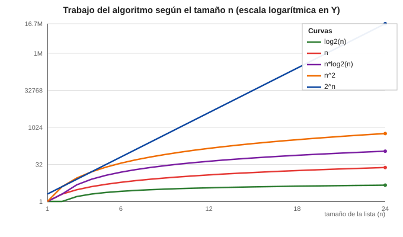

# Guía 6: Ordenamientos — bubble, merge y quicksort (y cómo medir "cuánto trabajan")

**Estás aquí:** [Inicio](../README.md) › [2. Fundamentos de TypeScript](README.md) › **Guía 6: Ordenamientos — bubble, merge y quicksort (y cómo medir "cuánto trabajan")**

## Objetivos

Al terminar esta guía deberías poder:

- Explicar qué significa ordenar una lista y por qué casi todas las aplicaciones ordenan datos.
- Escribir **bubble sort**, el ordenamiento más simple, y explicarlo vuelta por vuelta.
- Escribir **merge sort** y **quicksort**, y contar la idea de cada uno con palabras.
- Comparar los tres con una tabla de ventajas y desventajas, y saber cuál se usa más en la práctica (y por qué no hay "uno mejor siempre").
- Explicar de forma **superficial** qué es la [complejidad](../glosario.md#complejidad): cuánto trabajo hace un [algoritmo](../glosario.md#algoritmo) cuando la entrada crece.
- Distinguir, viendo un gráfico y un conteo real, entre crecimiento **logarítmico, lineal, n·log n, cuadrático y exponencial**.

> **Cómo probar los ejemplos**
>
> Como en la guía anterior: guarda las funciones en `.ts` y ejecuta con `npx tsx ordenamientos.ts`. Si quieres, quita los tipos y usa `node`.

## 1. El problema: "tengo una lista y la quiero acomodada"

Todos los programas manejan listas: productos de un catálogo, notas de estudiantes, mensajes por fecha. Y casi nunca las queremos "revueltas".

> *"Quiero que los datos queden en un orden: de menor a mayor, alfabético, por fecha."*

Ordenar no es un lujo estético: es la base para **encontrar rápido** (en un directorio ordenado sabes por dónde buscar), para **comparar** (dos listas ordenadas se revisan en un pase) y para **presentar** resultados con sentido. Un algoritmo de ordenamiento es la receta que convierte una lista desordenada en una ordenada. Existen decenas; aquí verás tres que representan tres familias de ideas.

## 2. Bubble sort: el más simple (y el más lento)

### La idea

Camina por la lista de vecino en vecino. Si el de la izquierda es mayor que el de la derecha, los intercambia. Al terminar una pasada, el número más grande quedó al final, "subió como una burbuja". Haces otra pasada con el resto, y otra, hasta que la lista está ordenada.

Con `3 1 4 2`:

```text
pasada 1:  3 1 4 2 → 1 3 4 2 → 1 3 4 2 → 1 3 2 4   (el 4 subió al final)
pasada 2:  1 3 2 [4] → 1 2 3 [4]                       (el 3 quedó antes del 4)
pasada 3:  1 2 [3 4]                                   (nada por cambiar; listo)
```

Cada pasada es más corta: lo que ya "subió" ya está en su lugar.

### El código

```ts
function bubbleSort(numeros: number[]): number[] {
  const arr = [...numeros];

  for (let vuelta = 0; vuelta < arr.length - 1; vuelta++) {
    for (let i = 0; i < arr.length - 1 - vuelta; i++) {
      if (arr[i] > arr[i + 1]) {
        const temporal = arr[i];
        arr[i] = arr[i + 1];
        arr[i + 1] = temporal;
      }
    }
  }

  return arr;
}

console.log(bubbleSort([5, 2, 9, 1, 7])); // [1, 2, 5, 7, 9]
console.log(bubbleSort([3, 3, 2, 1]));    // [1, 2, 3, 3]
console.log(bubbleSort([]));              // []
console.log(bubbleSort([7]));             // [7]
```

Dos detalles importantes:

- `const arr = [...numeros]` hace una **copia**. Operamos sobre la copia y no alteramos la lista que nos pasan. Buena costumbre en general.
- Hay dos ciclos anidados ("repetición de una repetición"): uno camina de vecino en vecino; el otro repite el paseo, cada vez más corto. Cuando veas dos ciclos anidados sobre la misma lista, sospecha que el algoritmo hace trabajo **cuadrático** (lo veremos más abajo).

Ventajas: trivial de entender y de escribir. Desventaja: con listas grandes hace muchísimas comparaciones.

## 3. Merge sort: divide y vencerás

### La idea

Filosofía: *dividir y vencerás*. Para ordenar un problema grande, pártelo en mitades, ordena cada mitad (con la misma idea, recursivamente) y luego **mezcla** dos mitades ya ordenadas en una sola lista ordenada.

Con `5 2 9 1 7 3`:

```text
5 2 9 1 7 3
5 2 9 | 1 7 3
5 2 | 9 | 1 7 | 3
5 | 2 | 9 | 1 | 7 | 3     ← listas de 1: ya están "ordenadas"
  2 5 | 9 | 1 7 | 3
  2 5 9 | 1 3 7
  1 2 3 5 7 9             ← combinas y listo
```

El paso clave es **mezclar**: tomas dos listas ordenadas y vas sacando el menor de la cabeza de cada una.

### El código

```ts
function merge(izquierda: number[], derecha: number[]): number[] {
  const resultado: number[] = [];
  let i = 0;
  let j = 0;

  while (i < izquierda.length && j < derecha.length) {
    if (izquierda[i] <= derecha[j]) {
      resultado.push(izquierda[i]);
      i++;
    } else {
      resultado.push(derecha[j]);
      j++;
    }
  }

  return resultado.concat(izquierda.slice(i), derecha.slice(j));
}

function mergeSort(numeros: number[]): number[] {
  if (numeros.length <= 1) return numeros;

  const mitad = Math.floor(numeros.length / 2);
  const izquierda = mergeSort(numeros.slice(0, mitad));
  const derecha = mergeSort(numeros.slice(mitad));

  return merge(izquierda, derecha);
}

console.log(mergeSort([5, 2, 9, 1, 7, 3])); // [1, 2, 3, 5, 7, 9]
```

[Caso base](../glosario.md#caso-base): lista de 0 o 1 elemento ya está ordenada; no hay que hacer nada. A partir de ahí, "fusionar en orden" resuelve todo.

Ventajas: siempre hace ~n·log n de trabajo (sin "casos malos"), es **estable** (conserva el orden relativo de valores iguales) y es pan comido para listas enlazadas y para ordenar datos que no caben en memoria. Desventaja: usa [memoria extra](../glosario.md#memoria-extra) para las listas intermedias.

## 4. Quicksort: el que elige un pivote

### La idea

También [divide y vencerás](../glosario.md#divide-y-venceras), pero en vez de partir por la mitad, **elige un pivote** y coloca todo lo menor a la izquierda y lo mayor a la derecha. Cada lado se ordena con la misma idea ([recursión](../glosario.md#recursion)). Al final, unes: izquierda ordenada, [pivote](../glosario.md#pivote), derecha ordenada.

Con `5 2 9 1 7 3` y pivote 5:

```text
menores: 2 1 3   ← se ordenan recursivamente
pivote:  5
mayores: 9 7     ← se ordenan recursivamente

→ [1 2 3] + [5] + [7 9]  =  1 2 3 5 7 9
```

La versión más sencilla de estudiar crea listas nuevas:

```ts
function quickSort(numeros: number[]): number[] {
  if (numeros.length <= 1) return numeros;

  const pivote = numeros[0];
  const menores: number[] = [];
  const mayores: number[] = [];

  for (let i = 1; i < numeros.length; i++) {
    if (numeros[i] < pivote) {
      menores.push(numeros[i]);
    } else {
      mayores.push(numeros[i]);
    }
  }

  return [...quickSort(menores), pivote, ...quickSort(mayores)];
}

console.log(quickSort([5, 2, 9, 1, 7, 3])); // [1, 2, 3, 5, 7, 9]
```

Un detalle importante: si el pivote siempre es el menor (por ejemplo, lista ya ordenada y pivote = primer elemento), [quicksort](../glosario.md#quicksort) degenera y trabaja como bubble (cuadrático). Por eso las versiones profesionales usan pivote aleatorio o la variante llamada **introsort**.

Ventajas: en promedio es rapidísimo y en versiones "en el lugar" (sin listas nuevas) casi no usa memoria extra. Desventaja: mal elegido el pivote, cae al peor caso; la versión simple no es estable.

## 5. ¿Cuál es "el mejor"? No hay uno: depende del contexto

| Algoritmo | Trabajo típico | Peor caso | Memoria extra | Estable | Facilidad de entender |
|---|---|---|---|---|---|
| Bubble sort | n² | n² | ninguna | sí | máxima |
| Merge sort | n·log n | n·log n | O(n) | sí | media |
| Quicksort | n·log n | n² | pequeña (versión en el lugar) | no (versión simple) | media |

Y la respuesta a "cuál se usa más" que probablemente buscas:

- En [JavaScript](../glosario.md#javascript), `Array.prototype.sort()` ordena según un comparador y el algoritmo interno depende del motor; el estándar no exige TimSort. Para comparar números pasa `(a, b) => a - b`, porque sin comparador los valores se ordenan como texto.
- **Quicksort y sus variantes aparecen en algunas bibliotecas por su velocidad promedio y su uso moderado de memoria. Cada lenguaje y [biblioteca](../glosario.md#biblioteca) elige su propia implementación; no conviene asumir que todos usan el mismo algoritmo.
- **Merge sort** es la estrella cuando importa que el orden sea **estable** o cuando se ordenan datos enormes (que no caben en memoria) y datos en listas enlazadas.

Conclusión honesta: no existe "el algoritmo perfecto". Se elige según el orden inicial de los datos, si necesitamos estabilidad, cuánta memoria hay disponible y qué tan simple queremos el [código](../glosario.md#codigo). Saber de su existencia —como en esta guía— es más útil que memorizar uno solo.

Trampa clásica de JavaScript que conviene conocer ya: `[10, 2, 1].sort()` devuelve `[1, 10, 2]`. ¿Por qué? Porque `sort()` sin funciones compara **texto**, no números. Para ordenar números hay que pasar el comparador: `[10, 2, 1].sort((a, b) => a - b)`. Recuerda comprobarlo siempre.

## 6. Complejidad: medir cuánto trabajo hace el algoritmo

### ¿De qué hablamos?

Hasta ahora dijimos "hace muchísimas comparaciones" o "es rapidísimo". Conviene ponerle un lenguaje simple. La **complejidad (de forma superficial)** responde a una sola pregunta:

> **Si la lista crece, ¿cuánto crece el trabajo?**

Medir *trabajo* de forma sencilla = **contar comparaciones** (o pasos). Lo interesante no es el número exacto, sino la *forma* de crecer. Las formas importantes para nosotros son cinco.

### Las cinco curvas (y cómo leerlo sin fórmulas)

| Nombre | Cómo crece al duplicar n | Ejemplo cotidiano / algorítmico |
|---|---|---|
| **Logarítmica (log n)** | Crece apenas un pelito; casi plana | Buscar en un directorio partiendo a la mitad (búsqueda binaria) |
| **Lineal (n)** | Crece igual que la lista | Recorrer la lista una vez (sumar, buscar un dato) |
| **n·log n** | Un poquito más que lineal | Merge sort y quicksort (en su versión normal) |
| **Cuadrática (n²)** | Crece como el cuadrado: pum | Bubble sort; dos ciclos anidados; quicksort con mal pivote |
| **Exponencial (2ⁿ)** | Explota de inmediato | La recursión ingenua del [Fibonacci de la guía 5](guia-fibonacci.md) |

Un criterio de bolsillo que te salvará en entrevistas y en decisiones de diseño:

> Un [ciclo](../glosario.md#ciclo) sencillo sobre la lista → lineal. Dos ciclos anidados sobre la misma lista → cuadrático. Partir la lista a la mitad una y otra vez → logarítmico o n·log n.

### El gráfico



El eje Y está en escala logarítmica (cada rayita multiplica por 32) para que las cinco curvas se vean juntas. Léelo así:

- **log₂(n)** (verde): casi no sube. Aunque la lista se duplique, el trabajo apenas crece.
- **n** (rojo): sube de forma suave y constante, proporcional a la lista.
- **n·log₂(n)** (morado): sobre la lineal, pero respirando un poco más. Ahí viven merge y quicksort.
- **n²** (naranja): empieza parecida a la lineal y después dispara. Ahí vive bubble (y quicksort con mal pivote).
- **2ⁿ** (azul): sube como cohete desde temprano. Ahí vive la recursión ingenua de Fibonacci.

Con números pequeños (n = 2, 4, 8, 16, 32) el "trabajo aproximado" sería:

| n | log₂ n | n | n·log₂ n | n² | 2ⁿ |
|---|---:|---:|---:|---:|---:|
| 2 | 1 | 2 | 2 | 4 | 4 |
| 4 | 2 | 4 | 8 | 16 | 16 |
| 8 | 3 | 8 | 24 | 64 | 256 |
| 16 | 4 | 16 | 64 | 256 | 65536 |
| 32 | 5 | 32 | 160 | 1024 | 4294967296 |

Fíjate en la última fila: una lista de **32** elementos (¡una fila del aula!) con un algoritmo exponencial llegaría a miles de millones de pasos. Por eso un algoritmo exponencial resulta inviable incluso con entradas relativamente pequeñas, aunque sí aparece en algunos problemas y métodos exactos. Medir cómo crece el trabajo importa: **el mismo problema puede resolverse bien o quedar inútil según el algoritmo**.

### Verlo con tus propios números

En lugar de confiar en la teoría, cuenta las comparaciones de verdad:

```ts
function listaAleatoria(n: number, max = 1000): number[] {
  const lista: number[] = [];
  for (let i = 0; i < n; i++) {
    lista.push(Math.floor(Math.random() * max));
  }
  return lista;
}

function bubbleConConteo(numeros: number[]): number {
  const arr = [...numeros];
  let conteo = 0;

  for (let vuelta = 0; vuelta < arr.length - 1; vuelta++) {
    for (let i = 0; i < arr.length - 1 - vuelta; i++) {
      conteo++;
      if (arr[i] > arr[i + 1]) {
        const temporal = arr[i];
        arr[i] = arr[i + 1];
        arr[i + 1] = temporal;
      }
    }
  }

  return conteo;
}

for (const n of [10, 100, 1000, 10000]) {
  const datos = listaAleatoria(n);
  console.log(`n = ${n} → bubble: ${bubbleConConteo(datos)} comparaciones`);
}
```

Ejecútalo y anota los números. Verás que al multiplicar n por 10, las comparaciones de bubble se multiplican por ~100: ese es el "n²" hecho real. Modifica el script para que también cuente comparaciones dentro de `merge` y de `quickSort` (versión cortada que devuelve `{ ordenado, conteo }`) y compara las cuatro filas. Eso es sentir la complejidad, no memorizarla.

Una nota de honestidad: a esto, los cursos de algoritmos le pondrán el nombre **notación Big O** (dirán "bubble es O(n²)", "merge es O(n log n)"). La letra solo dice "de tal tamaño para arriba, el trabajo crece con esta forma". Si entiendes las cinco curvas, estás a un paso de leerla con naturalidad en cualquier lado.

## 7. Resolver antes de seguir

> Para cada ejercicio [entrega](../glosario.md#entrega): código, ejemplo de salida y una explicación de la estrategia.

### Nivel 0 - perderle el miedo

1. Traza a mano dos pasadas de bubble `6 1 8 3 2` y compara con la salida del [programa](../glosario.md#programa).
2. Prueba `bubbleSort`, `mergeSort` y `quickSort` con: lista ya ordenada, lista invertida, duplicados, un solo elemento y lista vacía. ¿Todas funcionan igual para un solo elemento?

### Nivel 1 - dominar lo básico

3. Copia `bubbleSort` y haz `bubbleSortDesc` que ordene de mayor a menor (¿qué cambia en una línea?).
4. Explica por qué la primera línea de `bubbleSort` hace una copia y qué pasaría sin ella.
5. Ordena una lista de palabras por cantidad de letras. Reutiliza una de las funciones imaginando que son números y adaptándola.

### Nivel 2 - merge y quicksort

6. Implementa `mergeSort` sin mirar el código y pruébala con las mismas listas del ejercicio 2.
7. Implementa `quickSort` y explícale a un compañero qué hace el pivote.
8. Modifica el script de conteo para que las tres versiones devuelvan su número de comparaciones en una lista de 100 y 1000 elementos. Arma la tabla y compárala con las curvas del gráfico.

### Nivel 3 - profundización

9. Investiga: ¿qué pasa con `quickSort` si la lista ya está ordenada y el pivote siempre es el primero? Mídelo con el [contador](../glosario.md#contador). ¿Qué se te ocurre para arreglarlo?
10. Prepara un pivote aleatorio (`numeros[Math.floor(Math.random() * numeros.length)]`) y compara los conteos del ejercicio 8.
11. Investiga qué garantiza el estándar de JavaScript sobre `Array.prototype.sort()` y qué algoritmo usa un motor concreto. Explica por qué no debemos asumir que todos los motores usan el mismo.

## 8. Vocabulario

Estas son las palabras que usa esta guía. Si alguna no te queda clara, el [glosario del curso](../glosario.md#capitulo-3) la explica con calma: qué es, un ejemplo y dónde la verás.

| Término | Definición corta |
| --- | --- |
| Ordenar | Acomodar datos según una regla de comparación. |
| Pasada / vuelta | Recorrido completo de la lista comparando vecinos. |
| Intercambio (swap) | Cambiar de sitio dos valores con una variable temporal. |
| Pivote | Valor elegido en quicksort para separar menores y mayores. |
| Divide y vencerás | Partir un problema en subproblemas, resolverlos y combinar resultados. |
| Estable | Algoritmo que conserva el orden relativo de valores iguales. |
| Complejidad | Cómo crece el trabajo de un algoritmo cuando crece la entrada. |
| Logarítmica / Lineal / Cuadrática / Exponencial | Formas de crecimiento del trabajo: casi plano, proporcional, cuadrado, disparado. |
| Big O | Notación para hablar de esa forma de crecimiento: "O(n²)" se lee "crece como n²". |
| In-place / en el lugar | Algoritmo que ordena usando poca o ninguna memoria extra. |

## 9. Herramientas para ver ordenamientos

- **visualgo.net** (sección Sorting): anima paso a paso bubble, merge y quicksort, con controles de velocidad y tamaño de la lista. Ideal para "ver" las pasadas.
- **Gráfico de esta guía** (`grafico-complejidad.svg`): vuelve a él después de hacer el ejercicio de conteo y comprueba que tus números siguen la misma forma de las curvas.
- Plataformas de retos (HackerRank, LeetCode): el conteo de comparaciones de la sección 6 es la semilla de todos los "problemas de complejidad" que verás más adelante.

## 10. Lo que viene después

Ya sabes que hay muchas maneras de hacer lo mismo, que algunas crecen mejor que otras y que se elige según el [contexto](../glosario.md#contexto). Esas decisiones —entender el problema, comparar estrategias, medir el trabajo— son el corazón de [la algoritmia avanzada opcional](../07-algoritmia/README.md) y de cómo elegir estructuras de datos en el proyecto. Y hay una conexión directa con la [guía de Fibonacci](guia-fibonacci.md): la recursión ingenua de allí es tu ejemplo más claro de la curva exponencial, el monstruo que querrás evitar siempre. Sigue cuando quieras con el módulo de algoritmia; el resto del curso no lo exige.

---

**Anterior:** [Guia 5: Fibonacci](guia-fibonacci.md) · **Siguiente:** [Guia 7: POO](guia-poo.md)
